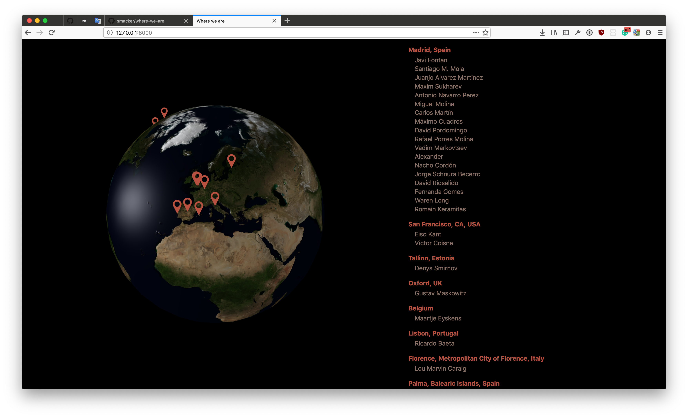

# Where we are

Deployed version: http://smacker.ru/where-we-are/



### Development

```
yarn
yarn dev
```

#### Update list of people

```
GITHUB_TOKEN= GMAP_KEY= node update_members.js
```

### Credits

- The Earth implementation heavily inspired by [Jerome Etienne](https://github.com/jeromeetienne/threex.planets/) and his [blog post](http://learningthreejs.com/blog/2013/09/16/how-to-make-the-earth-in-webgl/)
- Idea and most of the implementation for the sun movement borrowed from [Andrey Sitnik](https://sitnik.ru/)
